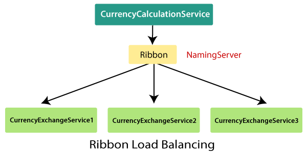
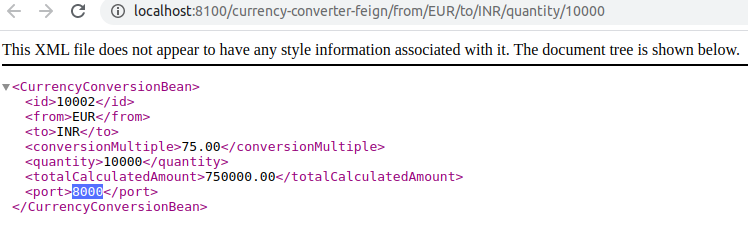
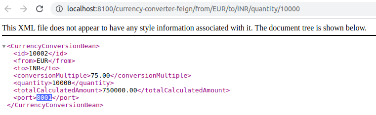

## Ribbon & Eureka

##### Netflix Ribbon
The Ribbon mainly provides client-side load balancing algorithms. It is a client-side load balancer that provides control over the behavior of HTTP and TCP client. The important point is that when we use Feign, the Ribbon also applies.

###Features of Ribbon
- Load balancing
- Fault tolerance
- Multiple protocol support in Asynchronous model
- Caching and batching

#####Modules
- **ribbon**: It is an API that integrates load balancing, fault-tolerance, caching, and
- **ribbon-loadbalancer**: It is a Load balancer API that can be used independently or with other modules.
- **ribbon eureka**: It uses Eureka client that provides a dynamic server list for the Spring Cloud.
- **ribbon-transport**: It is a transport client that supports HTTP, TCP, and UDP These protocols use RxNetty with load balancing capability.
- **ribbon-httpclient**: It is a REST client built on top of Apache HttpClient integrated with load balancers.
- **ribbon-core**: It is a Client Configuration API.

#####Types of Load Balancing:
There are two types of load balancing

- **Server Side Load Balancing**: Server side load balancing is a monolithic It applies between the client and the server. It accepts incoming network, application traffic, and distributes the traffic across the multiple backend servers by using various methods. The middle component is responsible for distributing the client requests to the server.
- **Client-Side Load Balancing**: The client holds the list of server’s IPs so that it can deliver the requests. The client selects an IP from the list, randomly, and forwards the request to the server.

##### Test urls

###### currency-converter-service call different currency-exchange-service in per request
http://localhost:8100/currency-converter-feign/from/EUR/to/INR/quantity/10000

###### direct different instance

